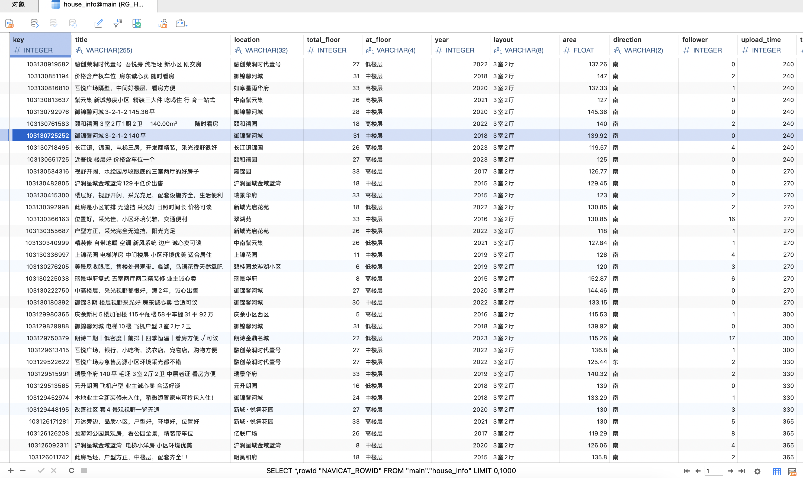

# 🕷️ House Info Spider
> 房屋信息爬虫

[![Contributors][contributors-shield]][contributors-url]
[![Forks][forks-shield]][forks-url]
[![Stargazers][stars-shield]][stars-url]
[![Issues][issues-shield]][issues-url]
[![MIT License][license-shield]][license-url]

- 从多个房产网站抓取房源数据
- 解析并提取关键信息(如价格、面积、位置等)
- 将数据保存到数据库中
- 提供数据分析和可视化功能

## 快速开始

1. 克隆项目到本地
2. 配置 `static/config.ini` 文件，填入需要爬取的网站、数据库路径、cookie 等信息；
2. 安装依赖: `pip install -r requirements.txt`
3. 运行爬虫: `python main.py`
4. 查看结果: `data.db` 文件中

## 许可证

本项目采用 MIT 许可证。详情请见 [LICENSE](LICENSE) 文件。

## 贡献

欢迎提交 issue 和 pull request 来完善这个项目!

<!-- Markdown link & img dfn's -->
[contributors-shield]: https://img.shields.io/github/contributors/JBpeople/house_info_spider.svg?style=for-the-badge
[contributors-url]: https://github.com/JBpeople/house_info_spider/graphs/contributors
[forks-shield]: https://img.shields.io/github/forks/JBpeople/house_info_spider.svg?style=for-the-badge
[forks-url]: https://github.com/JBpeople/house_info_spider/network/members
[stars-shield]: https://img.shields.io/github/stars/JBpeople/house_info_spider.svg?style=for-the-badge
[stars-url]: https://github.com/JBpeople/house_info_spider/stargazers
[issues-shield]: https://img.shields.io/github/issues/JBpeople/house_info_spider.svg?style=for-the-badge
[issues-url]: https://github.com/JBpeople/house_info_spider/issues
[license-shield]: https://img.shields.io/github/license/JBpeople/house_info_spider.svg?style=for-the-badge
[license-url]: https://github.com/JBpeople/house_info_spider/blob/master/LICENSE.txt
